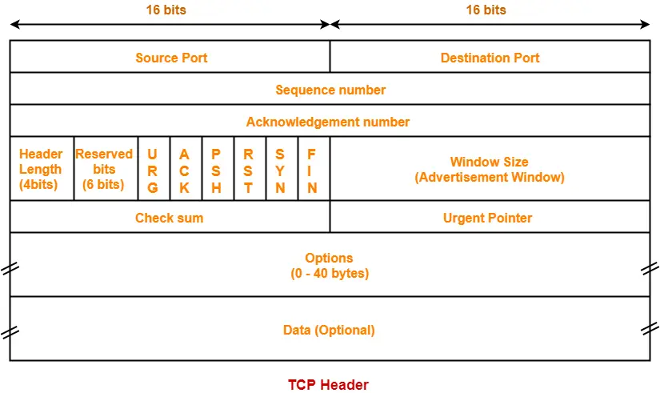

---
title: "Capitolo 14"
author: "Giulo Romano De Mattia via Deepseek"
date: "2026-04-29"
lang: it-IT
subject: "Protocollo TCP"
keywords: [protocol, TCP, ccna, transport, layer, socket]
geometry: margin=2.5cm
---


## LEZIONE 1 – TRANSPORTATION OF DATA  
### (Obiettivo: spiegare lo scopo del livello di trasporto nella gestione del trasferimento dati end‑to‑end)

### 1.1 Dove siamo? Un rapido ripasso del modello TCP/IP
Prima di immergerci, ricorda la pila TCP/IP. Sotto il livello Applicazione (HTTP, DNS, FTP…) c’è il **Transport Layer**. Sopra c’è l’Application, sotto c’è l’Internet Layer (IP). Il Transport Layer è il ponte tra le applicazioni che girano sui dispositivi e la rete che instrada i pacchetti. La sua missione è **gestire la comunicazione logica tra processi applicativi su host diversi**, nascondendo la complessità della rete sottostante alle applicazioni.

### 1.2 Responsabilità fondamentali del Transport Layer
Il livello di trasporto ha tre compiti principali:

1. **Tracciare le conversazioni individuali (Session Multiplexing)**  
   Sul tuo PC hai aperto contemporaneamente un browser, una chat, un client di posta. Ognuna di queste applicazioni genera flussi di dati. Il Transport Layer deve essere in grado di distinguere ogni flusso, sia in uscita che in arrivo, per consegnare i dati all’applicazione giusta. Questo avviene tramite i **numeri di porta** (approfondiremo più avanti).  
   *Pensa a un condominio: l’indirizzo IP è il numero civico, il numero di porta è il nome sul campanello del singolo appartamento.*

2. **Segmentazione e riassemblaggio**  
   Le applicazioni inviano stream di dati di dimensioni variabili. Il Transport Layer prende questi flussi, li divide in blocchi più piccoli chiamati **segmenti** (in TCP) o **datagrammi** (in UDP). Ogni pezzo viene incapsulato con un header di trasporto e passato al livello IP.  
   Quando i segmenti arrivano a destinazione, il Transport Layer del ricevente ricostruisce il flusso originale nell’ordine corretto e lo passa all’applicazione.  
   *Perché segmentare?* Perché il livello IP ha un limite massimo di dimensione (MTU) e spezzettare in unità più piccole permette di condividere la rete con altre conversazioni, ridurre i ritardi di accodamento e gestire meglio gli errori.

3. **Identificazione delle applicazioni (Port Numbers)**  
   Come detto, per indirizzare i dati al processo corretto, il Transport Layer utilizza numeri di porta a 16 bit (da 0 a 65535). Le porte ben note (0-1023) identificano servizi standard, le porte registrate (1024-49151) applicazioni proprietarie, le porte dinamiche/private (49152-65535) vengono assegnate temporaneamente ai client.  
   Un **socket** è la combinazione di indirizzo IP + protocollo di trasporto + numero di porta (es. 192.168.1.10:TCP:80). Una coppia di socket identifica univocamente una conversazione end‑to‑end.

### 1.3 Trasporto affidabile vs non affidabile
Il Transport Layer può offrire due tipi di servizio:
- **Affidabile (TCP):** garantisce la consegna ordinata, integra e senza duplicati. Richiede conferme, ritrasmissioni, controllo di flusso. Utilizzato quando l’applicazione non tollera perdite (web, email, file transfer).
- **Non affidabile (UDP):** semplice “best‑effort”, nessuna garanzia di consegna. Molto veloce, nessun overhead di connessione. Perfetto per streaming vocale/video, DNS, giochi online dove la velocità è più importante della perfezione.

Il livello di trasporto NON si occupa dell’instradamento (lo fa IP) né della trasmissione fisica, ma di ciò che avviene “da host a host” a livello di applicazione. La sua bellezza è che nasconde alle applicazioni i dettagli della rete.

### 1.4 Multiplexing e Demultiplexing
- **Multiplexing:** lato mittente, raccoglie dati da più socket applicativi, li incapsula in segmenti con l’intestazione di trasporto (inclusa la porta sorgente e destinazione) e li passa al livello di rete.
- **Demultiplexing:** lato ricevente, il Transport Layer esamina il segmento in arrivo, controlla la porta di destinazione e recapita i dati alla socket corretta.  
*In TCP il demultiplexing avviene considerando la quadrupla (IP sorgente, porta sorgente, IP destinazione, porta destinazione), mentre in UDP solo la porta destinazione; ecco perché TCP può gestire più connessioni verso lo stesso servizio.*

### 1.5 Un esempio concreto
Apri il browser e digita `www.cisco.com`.  
1. Il browser chiede al Transport Layer di stabilire una connessione TCP verso il server web (porta 80).  
2. Il Transport Layer segmenta la richiesta HTTP, aggiunge header TCP con porta sorgente (es. 49152) e porta destinazione 80, e la passa a IP.  
3. IP instrada i pacchetti.  
4. Sul server, il Transport Layer riceve il segmento, vede porta 80, lo passa al processo Apache in ascolto.  
5. Apache risponde; il Transport Layer incapsula i dati in segmenti TCP con porte invertite.  
6. Sul tuo PC, il Transport Layer usa la porta 49152 per recapitare la risposta al browser.  

Hai visto? Il Transport Layer gestisce l’intera conversazione, garantendo che ogni byte vada a segno.

**Riepilogo Transportation of Data:**  
- Multiplexing tra applicazioni  
- Segmentazione/riassemblaggio  
- Indirizzamento tramite porte  
- Può fornire servizio affidabile (TCP) o non affidabile (UDP)  

---

## LEZIONE 2 – TCP OVERVIEW  
### (Obiettivo: spiegare le caratteristiche di TCP)

Ora che hai chiaro cosa fa il Transport Layer, concentriamoci sul suo protocollo di punta: il **Transmission Control Protocol (TCP)**. È definito nella RFC 793 (aggiornata da molte altre) e incarna il servizio di trasporto **affidabile, orientato alla connessione e full‑duplex**.

### 2.1 Caratteristica 1: Orientato alla connessione
TCP non manda dati e basta. Prima di trasferire qualsiasi byte applicativo, stabilisce una sessione tra i due host tramite un **three‑way handshake**:
1. Il client invia un segmento SYN.
2. Il server risponde con SYN‑ACK.
3. Il client risponde con ACK.

Solo dopo questo scambio la connessione è attiva e i dati possono fluire. Al termine, una procedura analoga (scambio di FIN) chiude ordinatamente la connessione. Questo rende TCP **stateful**: ogni host mantiene informazioni sullo stato della connessione (numeri di sequenza, finestre, timer).

### 2.2 Caratteristica 2: Affidabilità e garanzia di consegna
TCP garantisce che i dati arrivino **integri, nell’ordine giusto e senza duplicati**. Come?
- **Numeri di sequenza (Sequence Number):** Ogni byte del flusso applicativo è numerato. Il Sequence Number (32 bit) nel header indica il primo byte del segmento corrente.
- **Riscontri (Acknowledgments):** Il ricevente invia segmenti con il flag ACK e un Acknowledgment Number che indica il prossimo byte atteso. Se il mittente non riceve un ACK entro un timeout (RTO), **ritrasmette** il segmento.
- **Rilevamento errori:** Il checksum TCP protegge l’integrità del segmento. Se corrotto, il segmento viene scartato e il mittente, non ricevendo ACK, lo ritrasmette.
- **Riordinamento:** I segmenti possono arrivare fuori ordine. TCP usa i numeri di sequenza per ricostruire il flusso corretto prima di passarlo all’applicazione.

### 2.3 Caratteristica 3: Controllo di flusso (Flow Control)
TCP evita che un mittente veloce sommerga un ricevente lento. Utilizza il **meccanismo a finestra scorrevole (Sliding Window)**.  
Il ricevente comunica nel campo **Window Size** (16 bit) la quantità di byte che è disposto ad accettare (oltre il byte già riscontrato). Il mittente può inviare al massimo quella quantità di dati senza attendere nuovi ACK.  
Questo permette di adattare dinamicamente la velocità di trasmissione alla capacità di elaborazione del destinatario.

### 2.4 Caratteristica 4: Controllo della congestione
Sebbene non sia menzionato nella RFC base, il TCP moderno implementa anche algoritmi di **congestion control** (slow start, congestion avoidance, fast retransmit, fast recovery) per prevenire il sovraccarico della rete. Scopi CCNA: ricorda che TCP riduce la velocità di invio se rileva perdite (segno di congestione), usando una finestra di congestione (cwnd) oltre alla finestra del ricevente. La finestra effettiva di invio è il minimo tra le due.

### 2.5 Caratteristica 5: Full‑Duplex
TCP è **bidirezionale simultaneo**. Durante una connessione entrambi gli host possono inviare e ricevere dati contemporaneamente. Ogni direzione ha i propri numeri di sequenza e finestre, indipendenti.

### 2.6 Caratteristica 6: Orientato al flusso di byte
TCP tratta i dati come un flusso continuo di byte, senza mantenere i confini dei messaggi applicativi. Se l’applicazione invia 100 byte e poi 200 byte, TCP potrebbe accodarli e inviare un segmento da 300 byte, oppure spezzarli in più segmenti. Sarà poi il ricevente a ricostruire l’ordine e a consegnare all’applicazione i byte esatti. (A differenza di UDP che conserva i confini dei datagrammi.)

### 2.7 Intestazione TCP (header)



L'header TCP base è di **20 byte** (160 bit), più un campo opzioni di lunghezza variabile. I dati applicativi seguono subito dopo.
Per comprendere le caratteristiche, dai un’occhiata ai campi principali dell’header TCP (20 byte di base):
- Porta sorgente e destinazione (16 bit ciascuna)
- Sequence Number (32 bit)
- Acknowledgment Number (32 bit)
- Data Offset (lunghezza header)
- Flag (SYN, ACK, FIN, RST, PSH, URG) – fondamentali per la gestione della sessione
- Window Size (16 bit)
- Checksum (16 bit)
- Urgent Pointer (poco usato)
- Opzioni (es. MSS negoziato durante handshake)


Ora analizziamo **ogni singolo campo** con la potenza di un microscopio.

### CAMPO 1: PORTA SORGENTE (Source Port) – 16 bit

**Dimensione:** 2 byte  
**Range:** da 0 a 65.535

**Che cos'è:** Identifica il processo applicativo **mittente** (quello che invia il segmento).

**Come funziona:**
- **Lato client:** Viene assegnata dinamicamente dal sistema operativo, scegliendo una **porta effimera** (privata/dinamica) nel range 49.152–65.535. Esempio: quando apri Chrome, il SO assegna la porta 51.234 alla connessione verso il server web.
- **Lato server:** È la porta su cui il servizio è in ascolto (es. 80 per HTTP, 443 per HTTPS). Il server la imposta quando risponde al client (inverte sorgente/destinazione).

**Ruolo nel demultiplexing:** Quando il server risponde, il client usa la porta sorgente originaria per recapitare i dati all'applicazione giusta. Senza di essa, il computer non saprebbe se il segmento in arrivo è per il browser, il client email o la chat.

---

### CAMPO 2: PORTA DESTINAZIONE (Destination Port) – 16 bit

**Dimensione:** 2 byte  
**Range:** da 0 a 65.535

**Che cos'è:** Identifica il processo applicativo **destinatario** sul host ricevente.

**Come funziona:**
- **Richiesta iniziale:** Il client imposta la porta di destinazione al servizio desiderato (es. 80 per HTTP, 25 per SMTP).
- **Risposta:** Il server inverte i ruoli: la porta destinazione diventa la porta sorgente del client originale.

**Ruolo nel demultiplexing:** È il campo principale che il sistema operativo del destinatario controlla per sapere a quale applicazione consegnare i dati. È l'equivalente del "nome sul campanello" che permette al postino di lasciare il pacco alla persona giusta.

---

### CAMPO 3: NUMERO DI SEQUENZA (Sequence Number) – 32 bit

**Dimensione:** 4 byte  
**Range:** da 0 a 4.294.967.295 (poi riparte da 0, wraparound)

**Che cos'è:** Il numero del **primo byte di dati** contenuto nel segmento corrente, all'interno del flusso continuo di byte che TCP sta trasmettendo.

**Come funziona:**
1. All'inizio della connessione (SYN), il mittente sceglie un numero di sequenza iniziale casuale (ISN - Initial Sequence Number), es. ISN = 1000. Questo per motivi di sicurezza (evitare attacchi di session hijacking su connessioni precedenti).
2. Se il primo segmento dati contiene 500 byte, il Sequence Number sarà 1001 (perché il SYN consuma 1 numero di sequenza, quindi ISN+1).
3. Il segmento successivo avrà Sequence Number = 1001 + 500 = 1501.
4. Se manda un altro segmento con 300 byte, il SN sarà 1501. Il prossimo sarà 1801, e così via.

**Perché è fondamentale:**
- Permette al ricevente di **riordinare** i segmenti che arrivano fuori ordine.
- Permette di **rilevare duplicati** (se arriva un segmento con SN già ricevuto, viene scartato).
- È alla base del meccanismo di **ritrasmissione** (il mittente sa esattamente quali byte sono stati persi).

**Nota importante:** Anche segmenti senza dati (SYN, FIN, ACK puri) consumano un numero di sequenza. Un segmento con il flag SYN attivo (handshake) consuma 1 numero di sequenza, anche se non trasporta dati.

---

### CAMPO 4: NUMERO DI RISCONTRO (Acknowledgment Number) – 32 bit

**Dimensione:** 4 byte

**Che cos'è:** Indica il **prossimo numero di sequenza che il ricevente si aspetta di ricevere**. In altre parole, conferma la ricezione di tutti i byte precedenti.

**Come funziona:**
- Se il destinatario ha ricevuto correttamente tutti i byte fino al numero di sequenza 1500 (quindi i byte 1001-1500), invierà un segmento con Acknowledgment Number = 1501.
- Significa: "Ho ricevuto tutto fino a 1500, ora mandami il byte 1501 e successivi".

**Quando è valido?** Solo se il flag **ACK** è impostato a 1. Dopo la fase di handshake iniziale, praticamente **ogni** segmento TCP ha il flag ACK a 1 (tranne il primissimo SYN del client).

**Nota tecnica:** L'ACK è cumulativo. Se ricevi i segmenti con SN 1001 (500 byte) e SN 2001 (300 byte), ma ti manca SN 1501 (500 byte), continui a mandare ACK=1501 finché non arriva il segmento mancante. Non puoi riscontrare SN 2001 finché non hai tutti i byte intermedi. Questo è il motivo per cui TCP garantisce l'ordine.

---

### CAMPO 5: DATA OFFSET (o Header Length) – 4 bit

**Dimensione:** 4 bit (mezzo byte)  
**Range di valori:** da 5 a 15

**Che cos'è:** Indica la **lunghezza dell'header TCP in multipli di 4 byte (32 bit)**. Serve a sapere dove finisce l'header e iniziano i dati.

**Come calcolare:**
- Valore minimo: 5 → 5 × 4 byte = 20 byte (header base, senza opzioni). Questo è l'header TCP standard.
- Valore massimo: 15 → 15 × 4 byte = 60 byte (con opzioni massime, fino a 40 byte di opzioni).
- Esempio: Data Offset = 8 → l'header è lungo 8 × 4 = 32 byte. I dati iniziano al byte 33.

**Perché serve:** A differenza di IP, l'header TCP non ha una lunghezza fissa a causa del campo opzioni. Il ricevente deve sapere esattamente dove iniziano i dati applicativi.

---

### CAMPO 6: RISERVATO (Reserved) – 3 bit / 4 bit

**Dimensione:** Dimezzato nel tempo. Originariamente 6 bit, oggi alcune RFC ne usano 4 per funzioni sperimentali, lasciandone 2-3 realmente riservati per usi futuri.

**Valore attuale:** Devono essere impostati a **zero**. Servono per eventuali estensioni future del protocollo.

**Per il CCNA:** Non preoccupartene. Se vedi un segmento con bit riservati != 0, il ricevente lo scarta. Fine.

---

### CAMPO 7: FLAGS (o Control Bits) – 6 bit (originariamente), ora 9 bit

Questi sono i **bit di controllo** che governano lo stato della connessione TCP. Ogni flag è un interruttore: 0 = disattivato, 1 = attivato. Eccoli dal più significativo al meno significativo (in una visione estesa moderna):

#### I 6 flag fondamentali per il CCNA:

| Flag | Nome | Significato e Utilizzo |
|---|---|---|
| **URG** | Urgent | Rende valido il campo "Puntatore Urgente". Indica dati urgenti da processare subito. Raramente usato, quasi obsoleto. |
| **ACK** | Acknowledgment | Rende valido il campo "Acknowledgment Number". Tutti i segmenti dopo il SYN iniziale hanno ACK=1. |
| **PSH** | Push | Dice al ricevente di passare subito i dati all'applicazione, senza bufferizzare. Usato da applicazioni interattive (es. Telnet). |
| **RST** | Reset | Abortisce la connessione immediatamente. Usato per rifiutare connessioni (es. nessun servizio in ascolto sulla porta) o per chiudere in modo forzato. |
| **SYN** | Synchronize | Usato per stabilire la connessione (three-way handshake). Sincronizza i numeri di sequenza iniziali. |
| **FIN** | Finish | Usato per chiudere la connessione in modo ordinato. Indica che il mittente ha finito di inviare dati. |

#### Le combinazioni più viste nelle catture:
- `SYN` → Primo passo handshake (client → server)
- `SYN+ACK` → Secondo passo handshake (server → client)
- `ACK` → Riscontro dati, usato durante tutto il trasferimento
- `FIN+ACK` → Chiusura connessione
- `RST+ACK` → Reset immediato

---

### CAMPO 8: DIMENSIONE FINESTRA (Window Size) – 16 bit

**Dimensione:** 2 byte  
**Range standard:** da 0 a 65.535 byte (64 KB)  
**Con Window Scale Option:** fino a 1 GB (1.073.741.823 byte)

**Che cos'è:** Indica la **quantità di byte che il mittente di questo segmento è disposto a ricevere**, a partire dall'Acknowledgment Number.

**Meccanismo di Flow Control (finestra scorrevole):**
- **Esempio pratico:** Il ricevente manda un segmento con `ACK=1501` e `Window=8192`. Significa: "Ho ricevuto fino al byte 1500. Puoi mandarmi fino a 8192 byte a partire dal byte 1501 (cioè i byte da 1501 a 9693) senza aspettare ulteriori conferme".
- Il mittente può trasmettere liberamente dati **finché la quantità di byte inviati ma non ancora riscontrati è ≤ Window Size**.
- Se Window=0, il mittente deve fermarsi completamente e attendere un segmento con Window>0 (Zero Window Probe).

**Perché è cruciale:** Evita che un mittente veloce (es. server su rete 10 Gbps) inondi un ricevente lento (es. smartphone su rete mobile) che non riesce a processare i dati. La finestra funge da "freno" dinamico.

---

### CAMPO 9: CHECKSUM – 16 bit

**Dimensione:** 2 byte

**Che cos'è:** Un codice di controllo per rilevare **errori** nell'intero segmento TCP (header + dati + pseudo-header).

**Come funziona:**
- Il mittente calcola il checksum su:
  - Pseudo-header IP (IP sorgente, IP destinazione, protocollo=6 per TCP, lunghezza segmento TCP)
  - Header TCP (con campo checksum temporaneamente azzerato)
  - Dati applicativi
- Il ricevente ricalcola il checksum e lo confronta con quello ricevuto.
- **Se differiscono:** il segmento viene **scartato** (non invia NACK, semplicemente non manda ACK, il mittente timeout-a e ritrasmette).

**Perché esiste anche se il livello 2 (Ethernet) e il livello 3 (IP) hanno i loro checksum?** Perché TCP vuole essere **robusto end-to-end**. IP controlla solo l'header IP, non i dati. TCP si assicura che i dati arrivino integri all'applicazione, indipendentemente da ciò che succede nei livelli inferiori (router con memoria corrotta, bug, ecc.).

---

### CAMPO 10: PUNTATORE URGENTE (Urgent Pointer) – 16 bit

**Dimensione:** 2 byte

**Che cos'è:** Indica un offset dal Sequence Number corrente che punta all'ultimo byte di dati urgenti.

**Validità:** Solo se il flag **URG** è impostato a 1.

**Utilizzo:** Praticamente obsoleto nelle reti moderne. In teoria, permette di inserire dati urgenti nel flusso che il ricevente deve processare subito (es. Ctrl+C in una sessione Telnet per interrompere un processo). Le implementazioni moderne tendono a ignorarlo o gestirlo con PSH.

---

### CAMPO 11: OPZIONI (Options) – da 0 a 40 byte

**Dimensione:** Variabile, multipla di 4 byte (padding se necessario)

**Che cos'è:** Estensioni al protocollo TCP base. Vengono negoziate principalmente durante l'handshake (segmenti SYN).

**Opzioni fondamentali per il CCNA:**

| Opzione | Dimensione | A cosa serve |
|---|---|---|
| **MSS (Maximum Segment Size)** | 4 byte | La dimensione massima del segmento dati che il mittente vuole ricevere. Si negozia nel SYN. Evita la frammentazione IP. Valori tipici: 1460 byte (Ethernet 1500 - 20 IP - 20 TCP). |
| **Window Scale** | 3 byte | Moltiplica il Window Size per un fattore (fino a 2^14). Permette finestre > 64 KB. Necessario su collegamenti ad alta latenza e banda (Long Fat Networks). |
| **SACK (Selective ACK)** | 2 byte (permesso) + 8/10 (dati) | Permette al ricevente di riscontrare blocchi di dati non contigui, così il mittente può ritrasmettere solo i segmenti persi, non tutto dalla perdita in poi. |
| **Timestamp** | 10 byte | Misura il Round Trip Time (RTT) e protegge da wraparound dei numeri di sequenza (PAWS - Protection Against Wrapped Sequences). |

**Come funzionano:**
- Nel segmento SYN, il client dice al server quali opzioni supporta (es. "Supporto Window Scale, il mio MSS è 1460").
- Il server nel SYN+ACK risponde con le opzioni che accetta.
- Se concordate, vengono usate per tutta la connessione.

---

### DATI (Payload) – Dimensione variabile

Dopo l'header, ci sono i dati veri e propri provenienti dal livello Applicazione. La dimensione dipende da:
- MSS negoziato
- Dimensione della finestra del ricevente
- Spazio disponibile nel buffer di invio
- Algoritmi di controllo congestione (cwnd)

Tutto ciò che abbiamo spiegato (sequenza, ack, finestra, checksum) ha un unico scopo: **trasportare questi dati in modo affidabile e ordinato**.

---

## PERCHÉ IL SEQUENCE NUMBER È FONDAMENTALE?

TCP deve affrontare tre problemi, e il Sequence Number li risolve tutti:

### 1. RIORDINAMENTO (Reordering)
I pacchetti IP possono prendere percorsi diversi e arrivare fuori ordine.
- **Esempio:** Il mittente invia i segmenti A (byte 1001-2000), B (byte 2001-3000), C (byte 3001-4000).
- **Arrivo:** C, poi A, poi B.
- **Soluzione:** Il ricevente guarda i Sequence Number, capisce che C è il terzo, lo mette da parte, aspetta A e B, poi li mette in fila e consegna all'applicazione in ordine: 1001, 1002, 1003...

### 2. RILEVAMENTO DUPLICATI
Un ACK può perdersi, il mittente pensa che un segmento sia andato perso e lo ritrasmette. Ma magari era arrivato, solo l'ACK non è tornato indietro.
- **Esempio:** Il segmento con SN=2001 arriva a destinazione, ma il mittente lo ritrasmette comunque (timeout).
- **Soluzione:** Il ricevente vede un segmento con SN=2001 che ha già ricevuto e lo scarta silenziosamente.

### 3. RITRASMISSIONE SELETTIVA
Il Sequence Number permette al ricevente di dire esattamente quali byte ha ricevuto e quali mancano.

---

## IL NUMERO DI SEQUENZA INIZIALE (ISN)

All'inizio di una connessione, TCP non parte da 0 o da 1. **Sceglie un numero casuale**, chiamato **ISN (Initial Sequence Number)**.

**Perché casuale?** Motivi di sicurezza.
- Se partisse sempre da 0, un attaccante potrebbe facilmente indovinare i numeri di sequenza e iniettare pacchetti falsi nella connessione (TCP session hijacking).
- Se due connessioni consecutive tra gli stessi host usassero lo stesso ISN, vecchi pacchetti ritardati della connessione precedente potrebbero essere scambiati per validi.
- L'ISN viene generato con un algoritmo pseudocasuale basato su un clock interno.

**Esempio:** Host A sceglie ISN = 5000. Host B sceglie ISN = 9000. Le due direzioni del flusso sono completamente indipendenti.

---

## COME EVOLVE IL SEQUENCE NUMBER PASSO DOPO PASSO

Prendiamo una connessione semplice: Client A vuole inviare un file di 3000 byte al Server B.

### FASE 1: Three-Way Handshake (nessun dato, solo sincronizzazione)

**Passo 1: Client → Server (SYN)**
- Flag: SYN=1, ACK=0
- Sequence Number = ISN_Client = 5000
- Il SYN consuma **1 numero di sequenza**.
- Significato: "Ciao server, voglio sincronizzarmi. Il mio primo byte di dati inizierà da 5001."

**Passo 2: Server → Client (SYN+ACK)**
- Flag: SYN=1, ACK=1
- Sequence Number = ISN_Server = 9000
- Acknowledgment Number = 5001
- Significato: "Ho ricevuto il tuo SYN (fino al byte virtuale 5000). Il mio primo byte inizierà da 9001. Aspetto il tuo byte 5001."

**Passo 3: Client → Server (ACK)**
- Flag: ACK=1
- Sequence Number = 5001
- Acknowledgment Number = 9001
- Significato: "Ho ricevuto il tuo SYN. Il mio prossimo segmento conterrà dati a partire dal byte 5001."

---

### FASE 2: Trasferimento Dati

**Passo 4: Client → Server (PSH+ACK, 1000 byte di dati)**
- Sequence Number = 5001
- Acknowledgment Number = 9001
- Dati: 1000 byte (byte logici 5001, 5002, ..., 6000)
- Significato: "Ti mando 1000 byte, dal 5001 al 6000."

**Cosa fa il server:**
- Riceve i byte 5001-6000.
- Li mette nel buffer di ricezione.
- Prepara un segmento di riscontro.

**Passo 5: Server → Client (ACK)**
- Sequence Number = 9001
- Acknowledgment Number = 6001
- Significato: "Ho ricevuto TUTTO fino al byte 6000. Ora aspettami il byte 6001."

**Passo 6: Client → Server (PSH+ACK, 1500 byte di dati)**
- Sequence Number = 6001
- Dati: 1500 byte (6001 ... 7500)
- Acknowledgment Number = 9001 (non cambia perché il server non ha inviato nuovi dati)

**Passo 7: Server → Client (ACK)**
- Acknowledgment Number = 7501
- Significato: "Ricevuti fino a 7500, manda il 7501."

**Passo 8: Client → Server (PSH+ACK, ultimi 500 byte)**
- Sequence Number = 7501
- Dati: 500 byte (7501 ... 8000)
- Flag FIN=1? No, aspettiamo la chiusura.

**Passo 9: Server → Client (ACK)**
- Acknowledgment Number = 8001
- Significato: "Ho tutto il file. Byte da 5001 a 8000 ricevuti."

---

### RIEPILOGO GRAFICO DEL FLUSSO

```
CLIENT (ISN=5000)                    SERVER (ISN=9000)
      |                                     |
   SYN, SN=5000 (consuma 1)                 |
      |------------------------------------>|
      |                                     |
      |                          SYN+ACK, SN=9000, ACK=5001
      |<------------------------------------|
      |                                     |
   ACK, SN=5001, ACK=9001                  |
      |------------------------------------>|
      |                                     |
   Dati 1000 byte, SN=5001                  |
      |------------------------------------>|
      |                                     |
      |                     ACK, SN=9001, ACK=6001
      |<------------------------------------|
      |                                     |
   Dati 1500 byte, SN=6001                  |
      |------------------------------------>|
      |                                     |
      |                     ACK, SN=9001, ACK=7501
      |<------------------------------------|
```

---

## LA REGOLA FONDAMENTALE DEL SEQUENCE NUMBER

**Formula magica:**
```
SN_segmento_successivo = SN_segmento_corrente + numero_di_byte_dati
                        (+ 1 se il segmento corrente aveva SYN o FIN)
```

**Perché SYN e FIN consumano un numero di sequenza?**
Perché devono essere **riscontrabili**. Il ricevente deve poter confermare: "Ho ricevuto il tuo SYN" o "Ho ricevuto il tuo FIN". Se non consumassero un numero di sequenza, non ci sarebbe modo di sapere se sono arrivati. Per convenzione, un segmento con SYN o FIN conta come se avesse 1 byte di dati "virtuali".

**Esempi:**
- Segmento SYN: SN=5000 → il prossimo SN sarà 5001
- Segmento dati 500 byte: SN=5001 → prossimo SN=5501
- Segmento FIN (senza dati): SN=8001 → il prossimo SN sarà 8002
- Segmento FIN+PUSH con 50 byte: SN=8001 → prossimo SN=8051 (50 dati + 1 per FIN) → verifica: sono 50 byte dati, quindi SN finale = 8001 + 50 = 8051. Ma il FIN consuma un numero extra? Il segmento FIN che trasporta dati: il FIN stesso non consuma un numero di sequenza aggiuntivo *oltre* ai dati se i dati sono presenti? La regola è: SYN e FIN consumano un numero di sequenza. Se un segmento ha SYN e dati (impossibile, SYN non porta dati applicativi), la formula sarebbe SN + dati + 1. Per FIN con dati: SN + dati + 1. Esatto.

---

## COSA SUCCEDE IN CASO DI PERDITA? IL RUOLO DEL SN/ACK

**Scenario:** Il client invia tre segmenti:
- Seg 1: SN=5001, 1000 byte (5001-6000)
- Seg 2: SN=6001, 1000 byte (6001-7000)  → **PERSO**
- Seg 3: SN=7001, 1000 byte (7001-8000)

**Comportamento del server:**
1. Riceve Seg 1. ACK=6001 ("fino a 6000 ok").
2. Riceve Seg 3. Guarda il SN=7001. Ma si aspettava SN=6001! Capisce che c'è un buco. Scarta Seg 3? No! Lo mette da parte nel buffer di riordino.
3. Invia comunque ACK=6001 ("mi manca sempre 6001!"). Questo è un **Duplicate ACK**.
4. Il client riceve tre ACK duplicati (o scade il timeout) e capisce che Seg 2 è perso. Ritrasmette solo Seg 2 (SN=6001).
5. Il server riceve Seg 2. Ora ha Seg 1, 2 e 3. Riordina tutto: 5001-8000.
6. Invia ACK=8001 ("ho tutto fino a 8000!").

**Senza Sequence Number**, sarebbe impossibile rilevare il buco specifico e ritrasmettere solo il segmento mancante.

---

## NUMERAZIONE RELATIVA VS ASSOLUTA IN WIRESHARK

Quando usi Wireshark, vedrai spesso "Sequence Number (raw)" e "Sequence Number (relative)".

- **Raw (assoluto):** Il numero vero, casuale, scelto all'inizio. Es. 3.456.789.123.
- **Relative:** Wireshark lo normalizza facendo finta che l'ISN sia 0. Quindi il primo SYN mostra SN=0, il SYN+ACK del server mostra SN=0, il primo dato mostra SN=1 (perché SYN consuma 1). Il prossimo segmento dati con 500 byte mostra SN=1, poi SN=501.
- Questo per rendere le tracce più leggibili agli umani. **Per l'esame CCNA, ragiona sempre con i numeri relativi**, ma sappi che nella realtà sono casuali.

---

## QUADRO RIASSUNTIVO FINALE

| Concetto | Spiegazione |
|---|---|
| **Sequence Number** | Numero del primo byte di dati nel segmento corrente |
| **ISN** | Numero di sequenza iniziale casuale, scambiato via SYN |
| **Incremento** | SN_successivo = SN_corrente + byte_dati (+ 1 se SYN o FIN) |
| **SYN / FIN** | Consumano 1 numero di sequenza ciascuno |
| **Riordinamento** | Il ricevente usa il SN per mettere in ordine i segmenti fuori sequenza |
| **Rilevamento duplicati** | Se arriva un segmento con SN già ricevuto, viene scartato |
| **Ritrasmissione** | Il mittente sa quali byte ritrasmettere in base all'ACK del ricevente |
| **Range** | 0 – 2^32-1 (wraparound ogni ~4,3 GB) |

---

## CHE COS'È UN SOCKET?

### La definizione essenziale
Un **socket** è l'**interfaccia tra l'applicazione e il livello di trasporto**. In pratica, è il "punto terminale" (endpoint) di una comunicazione attraverso la rete. È il meccanismo con cui il sistema operativo mette a disposizione delle applicazioni i servizi del Transport Layer (TCP o UDP).

**Definizione tecnica:** Un socket è identificato dalla combinazione univoca di:
```
Indirizzo IP + Protocollo di Trasporto + Numero di Porta
```
Esempio: `192.168.1.10 + TCP + 80`

### La metafora della presa elettrica
Il termine "socket" in inglese significa "presa" (come la presa della corrente). Ed è la metafora perfetta:

- La **rete** è l'impianto elettrico della casa.
- Il **socket** è la presa nel muro a cui colleghi i dispositivi.
- L'**applicazione** è il dispositivo elettrico (lampada, computer, TV).

Per usare l'elettricità, non ti preoccupi di come funziona la centrale elettrica o i cavi: colleghi la spina alla presa. Allo stesso modo, un programmatore che scrive un'app di rete non deve preoccuparsi di come funzionano IP, router e switch: usa i socket per "attaccare" la sua applicazione alla rete e scambiare dati.

---

## TIPI DI SOCKET

Nel modello TCP/IP esistono principalmente due tipi di socket:

### 1. Socket Stream (TCP)
- Usa il protocollo **TCP**
- È **orientato alla connessione**: prima va stabilita una connessione (three-way handshake)
- È **affidabile**: garantisce consegna ordinata, integra, senza duplicati
- È un **flusso continuo di byte** senza confini di messaggio
- Esempio: web server in ascolto sulla porta 80

### 2. Socket Datagram (UDP)
- Usa il protocollo **UDP**
- È **connectionless**: nessuna connessione preliminare
- È **non affidabile**: non garantisce consegna, ordine, né evita duplicati
- **Preserva i confini** dei messaggi
- Esempio: server DNS in ascolto sulla porta 53

---

## COPPIA DI SOCKET: L'IDENTIFICATORE UNIVOCO DELLA CONVERSAZIONE

Per identificare **univocamente** una connessione TCP tra due host, non basta un socket singolo. Serve una **coppia di socket** (socket pair):

```
Socket Mittente:  (IP_Sorgente,  Porta_Sorgente,  Protocollo)
Socket Destinatario: (IP_Dest,      Porta_Dest,      Protocollo)
```

Esempio concreto di una connessione HTTPS:
```
Client:  192.168.1.10  + TCP + 50123
Server:  93.184.216.34 + TCP + 443
```

Questa **quadrupla** (più il protocollo) identifica in modo univoco quella specifica conversazione nell'intera Internet, in quel momento.

Questo spiega perché un server web (porta 80) può gestire **migliaia di client contemporaneamente**: ogni connessione è distinta perché ogni client ha un indirizzo IP e/o una porta sorgente diversa.

Esempio sul server web:
```
Connessione 1: Client1_IP:porta1 → Server_IP:80
Connessione 2: Client2_IP:porta2 → Server_IP:80
Connessione 3: Client1_IP:porta3 → Server_IP:80   (stesso client, altra scheda del browser)
```

Tutte convivono perché i socket client sono diversi.

---

## COME FUNZIONA A LIVELLO PRATICO (Lato Programmazione)

Anche se il CCNA non richiede che tu sia un programmatore, capire il flusso base aiuta molto:

**Lato Server (es. web server):**
1. Crea un socket specificando protocollo (TCP) e porta (80).
2. Associa (bind) il socket all'indirizzo IP locale e alla porta.
3. Si mette in ascolto (listen) di connessioni in ingresso.
4. Quando arriva una richiesta di connessione, il sistema operativo crea un **nuovo socket dedicato** a quel client specifico (con una porta locale != 80, dinamica), mentre il socket originale continua ad ascoltare nuove richieste sulla porta 80.
5. La comunicazione con quel client avviene sul nuovo socket.
6. Chiusa la conversazione, il socket dedicato viene distrutto.

**Lato Client (es. browser):**
1. Crea un socket specificando protocollo (TCP).
2. Il sistema operativo assegna automaticamente una **porta sorgente effimera** (es. 50123).
3. Il client richiede la connessione (connect) specificando IP e porta del server (93.184.216.34:443).
4. Completato l'handshake, il socket è connesso e può inviare/ricevere dati.
5. Alla chiusura, il socket viene rilasciato.

---

## SOCKET IN AZIONE SUL TUO PC

Se apri il prompt dei comandi e digiti (su Windows):
```
netstat -n
```
vedrai una lista di connessioni attive. Ogni riga mostra una coppia di socket:
```
Proto  Indirizzo locale:Porta    Indirizzo estero:Porta     Stato
TCP    192.168.1.10:50123        93.184.216.34:443         ESTABLISHED
TCP    192.168.1.10:50124        142.250.184.46:443        ESTABLISHED
TCP    0.0.0.0:80                0.0.0.0:*                 LISTENING
```
- Le prime due righe sono socket client connessi a server web.
- La terza è un socket server in ascolto sulla porta 80 (0.0.0.0 significa "tutti gli indirizzi IP locali").

---

## RIEPILOGO FINALE PER IL CCNA

| Concetto | Spiegazione |
|---|---|
| **Socket** | Interfaccia software tra applicazione e Transport Layer |
| **Identificazione** | IP + Protocollo (TCP/UDP) + Porta |
| **Coppia di socket** | Identifica univocamente una connessione end-to-end |
| **TCP Socket** | Orientato alla connessione, affidabile, stream |
| **UDP Socket** | Connectionless, non affidabile, datagram |
| **Porta ben nota** | Server (es. 80 HTTP, 443 HTTPS) |
| **Porta effimera** | Client (es. 50123), assegnata dinamicamente dal SO |

Il socket è il "gancio" che permette a un'applicazione di utilizzare i servizi del Transport Layer senza conoscere i dettagli della rete sottostante. È l'astrazione che rende possibile la programmazione di rete moderna.

